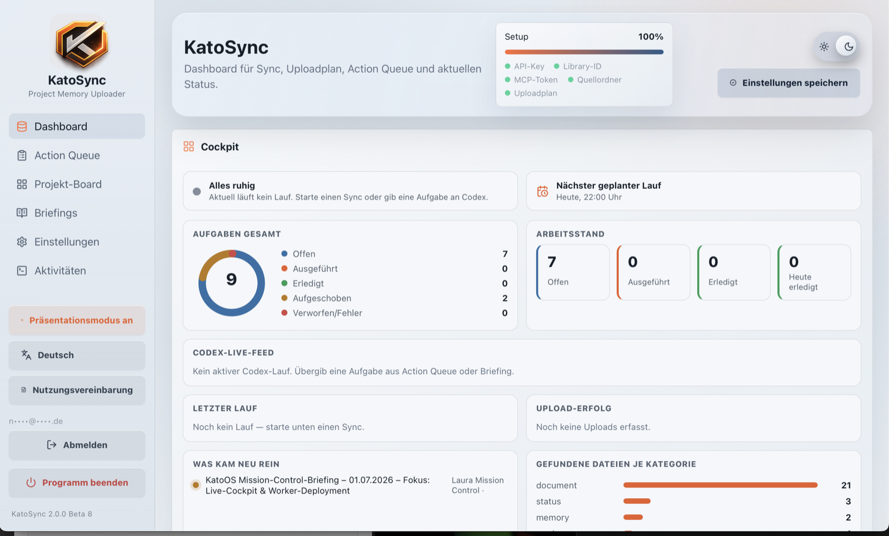
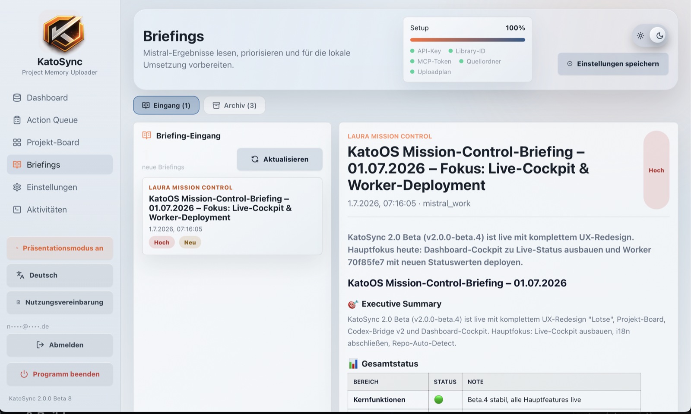
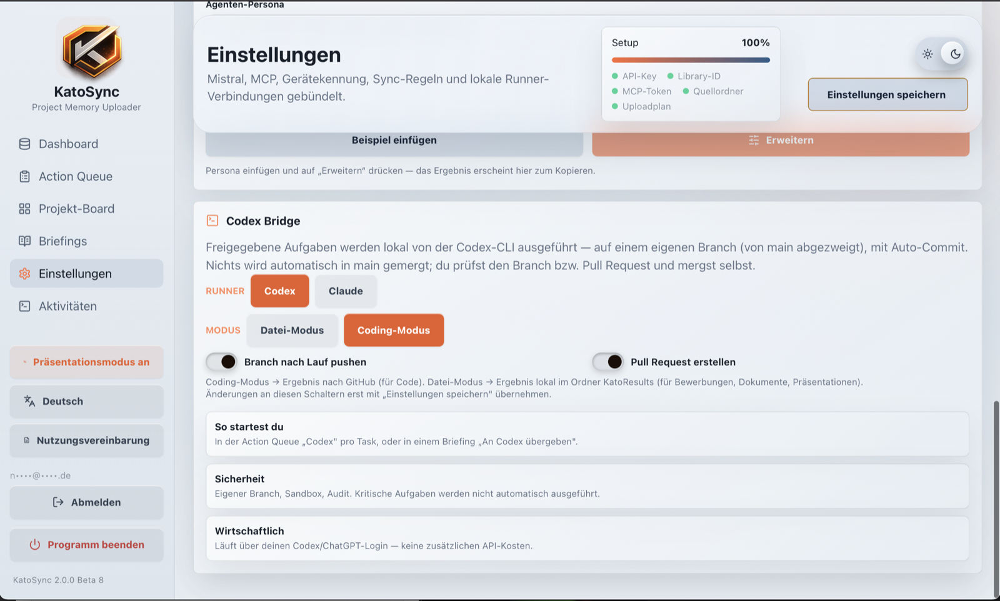
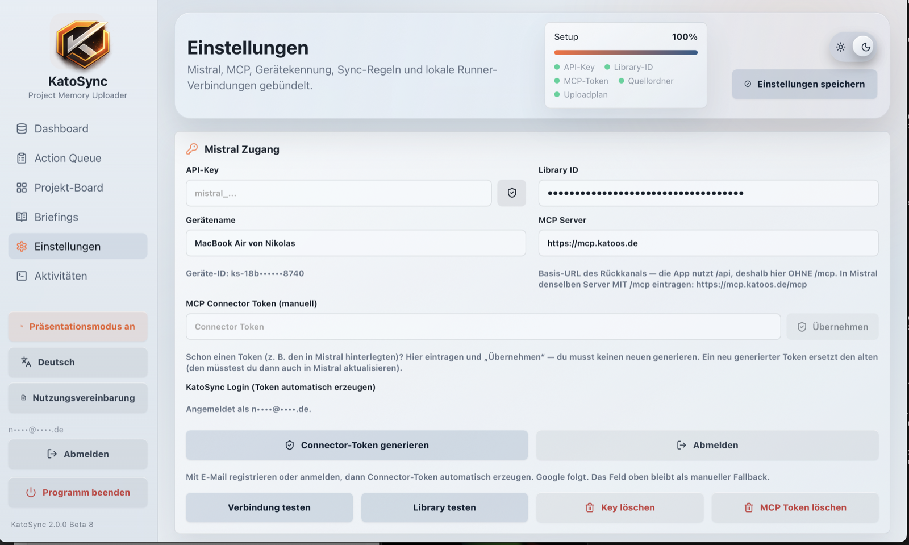
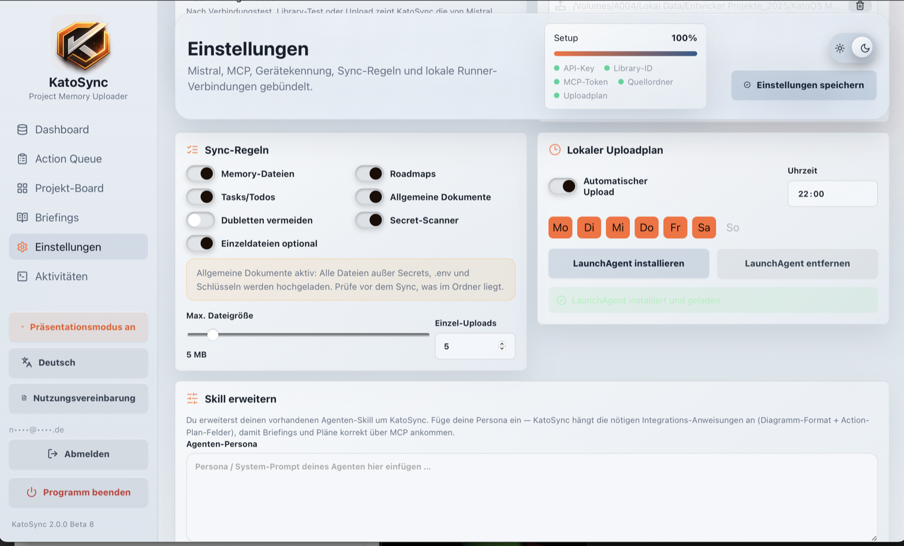

<!-- Created by NMKato on 2026-07-01 -->

<div align="center">


# KatoSync

**KI, die liefert statt nur redet.**
Dein Projekt-Wissen → ausgeführte Arbeit. Lokal &amp; sicher.


**[⬇️ Download (macOS) → Releases](https://github.com/NMKato/KatoSync/releases/latest)**

</div>

<p align="center">
  
</p>

---

## 🚀 Was ist KatoSync?

**KatoSync verwandelt dein Projekt-Wissen in ausgeführte Arbeit.** Die KI (Mistral) versteht deine
Projekte und plant konkrete Aufgaben — **du gibst frei** — und ein **lokaler Runner (Codex oder
Claude)** setzt sie in deinem echten Repo um: eigener Branch, Commit, Pull Request.

> Kein Chat, der nur redet. Kein Auto-Agent, der unkontrolliert loslegt.
> Sondern KI-Ergebnisse, die **du kontrollierst — lokal und sicher.**

---

## ❌ Das Problem

- **KI redet, liefert aber nicht** — Vorschläge statt fertiger, eingecheckter Arbeit → Copy-Paste-Chaos.
- **Projekt-Wissen ist verstreut** — Status, Notizen, Roadmaps, Code überall; die KI hat nie den vollen Kontext.
- **Auto-Agenten sind ein Blindflug** — Ausführen/Mergen ohne Freigabe = Risiko für Code, Secrets und Kosten.

---

## ✅ Die Lösung — der Coding-Workflow

KatoSync ist der **kontrollierte Brückenkopf** zwischen KI-Verständnis und lokaler Ausführung:

- [x] **Scannen** — deine Projektordner werden als saubere Wissensbasis bereitgestellt _(Secrets ausgeschlossen)_
- [x] **Planen** — Mistral-Agenten erzeugen projektbezogene Aufgaben → **Projekt-Board / Action Queue**
- [x] **Freigeben** — du triagierst und gibst frei _(Human-in-the-Loop — nichts läuft automatisch)_
- [x] **Ausführen** — lokaler Runner (**Codex CLI** oder **Claude Code CLI**) arbeitet auf einem **eigenen Branch von main**
- [x] **Liefern** — Auto-Commit → Push → **Pull Request** _(opt-in)_. **Kein Auto-Merge in main.**
- [x] **Abschließen** — Task ist „ausgeführt" → du prüfst/merged → „erledigt"; ein **Live-Feed** zeigt den Lauf

<p align="center">
  <br/>
  <sub>📨 <b>Die KI-Ergebnisse kommen zurück</b> — als lesbare, priorisierte Briefings (Executive Summary, Status-Ampeln, To-dos). Annehmen · an den Runner übergeben · ablehnen.</sub>
</p>

<p align="center">
  <br/>
  <sub>⚙️ <b>… und werden lokal ausgeführt</b> — Runner-Picker (Codex/Claude) &amp; Modus (Datei/Coding), eigener Branch, kein Auto-Merge.</sub>
</p>

---

## 🎯 Nutzen

- [x] Von der **Idee zum Pull Request** — ohne Copy-Paste
- [x] **Volle Kontrolle** — jede Ausführung ist freigegeben, nachvollziehbar (Branch/PR/Audit-Trail), reversibel
- [x] **Kein Vendor-Lock** — Codex ODER Claude, ein Klick
- [x] **Keine API-Kosten** — läuft über dein Abo-Login (ChatGPT/Claude), kein API-Key im Runner
- [x] **Lokal &amp; privat** — Code und Daten bleiben auf deinem Gerät

---

## 🔒 Sicherheit

- [x] **Human-in-the-Loop-Gate** — keine automatischen Merges, keine kritischen Aktionen ohne Freigabe
- [x] **Nichts läuft blind in main** — eigener Branch + Pull Request, du merged selbst
- [x] **Secrets bleiben lokal** — API-Key &amp; Connector-Token in der macOS-Keychain; **kein** Service-Role-Key in der App
- [x] **Cloud-Profil Zero-Knowledge** — Ende-zu-Ende verschlüsselt (Argon2id + AES-256-GCM, Schlüssel nur im RAM); der Server kann sie **nicht** lesen
- [x] **Gehärtet gegen Missbrauch** — Prompt-Injection-Leitplanken, Host-Allowlist, strikte CSP, Out-of-Scope-Schutz für den Runner
- [x] **Referenzdaten bleiben lokal** — private Dokumente (z. B. Lebenslauf) landen nie in Git oder der Cloud-Library

---

## 🗂️ Auch für den Alltag (Datei-Modus)

Derselbe Ablauf **ohne GitHub**: das Ergebnis landet lokal im Ordner `KatoResults` statt als Pull
Request — ideal für **Dokumente, Bewerbungen, Präsentationen**. KatoSync ist nicht nur für Code,
sondern für **jede wissensbasierte Aufgabe**.

---

## 📸 Screenshots

<table>
  <tr>
    <td align="center"><b>Mistral-Zugang &amp; MCP</b><br/></td>
    <td align="center"><b>Sync-Regeln &amp; Uploadplan</b><br/></td>
  </tr>
</table>

---

## 🧩 Architektur

Ein schlanker **MCP-Server** (Cloudflare Worker + Supabase) ist der Rückkanal: Mistral Work pusht
Aufgaben/Briefings via MCP-Tools, die Desktop-App liest sie über eine kontrollierte REST-Brücke und
führt **lokal** aus. **Der Server führt selbst nichts aus.**

- **Frontend** — React/TypeScript in **MVVM + Repository** (`src/App.tsx` ↔ `viewmodels/` ↔ `repositories/`)
- **Core** — Rust/Tauri (`src-tauri/src/lib.rs`): Scan, Secret-Filter, CURRENT-Dateien, Upload, macOS-Keychain, Runner-Lauf, LaunchAgent
- **i18n** De/En/Es/Ru · Light/Dark · Präsentationsmodus (maskiert Token/IDs/E-Mail für Screenshots)
- Mistral-API-Key &amp; Connector-Token liegen ausschließlich in der macOS-Keychain

---

## ⬇️ Installation (macOS)

Signiert (Developer ID, MK Heartbeat UG) + Apple-notarisiert — kein Gatekeeper-Umweg.

1. **[Neueste Version → Releases](https://github.com/NMKato/KatoSync/releases/latest)** laden
2. ZIP entpacken → `KatoSync.app` nach **„Programme"** ziehen
3. Starten → geführtes Onboarding (Login → 5-Schritt-Tour)

---

## 🛠️ Entwicklung &amp; Build

<details>
<summary>Setup, Dev-Server, Desktop-Build</summary>

```bash
npm install --cache ./.npm-cache
npm run dev          # Frontend (Browser-Demo)

# Desktop (braucht Rust):
rustup default stable
npm run tauri dev

# Build:
npm run build        # tsc + Vite (Frontend)
npm run tauri build  # Desktop-Bundle
```

Signierte/notarisierte Release-Builds: siehe `docs/RELEASE_OWNER_RUNBOOK.md`.
Hinweis: Auf exFAT-Volumes scheitert Tauris Signier-Schritt an `xattr` → manuell auf einer APFS-Kopie signieren/notarisieren (siehe Runbook).

</details>

---

## 🗺️ Roadmap

- [x] Cloud-Profil (Zero-Knowledge) — Zugangsdaten folgen dem Konto
- [x] Multi-Runner (Codex CLI + Claude Code CLI)
- [x] Auth-Flows (Bestätigung/Passwort-Reset) + Sicherheitshärtung
- [x] Modus-Umschalter (Datei-Modus | Coding-Modus)
- [ ] Datei-Modus end-to-end verifiziert
- [ ] Google-Login / KatoOS-Föderation

---

<div align="center">
<sub>Ein Produkt von <b>KatoOS</b> · MK Heartbeat UG — kein Auto-Merge, keine automatischen Zahlungen/E-Mails, keine Löschlogik für die Mistral-Library.</sub>
</div>
